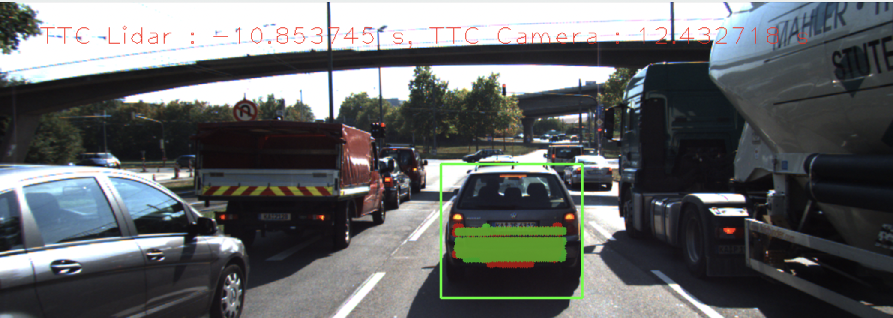

# SFND 3D Object Tracking

Welcome to the final project of the camera course. By completing all the lessons, you now have a solid understanding of keypoint detectors, descriptors, and methods to match them between successive images. Also, you know how to detect objects in an image using the YOLO deep-learning framework. And finally, you know how to associate regions in a camera image with Lidar points in 3D space. Let's take a look at our program schematic to see what we already have accomplished and what's still missing.


In this final project, you will implement the missing parts in the schematic. To do this, you will complete four major tasks: 
1. First, you will develop a way to match 3D objects over time by using keypoint correspondences. 
2. Second, you will compute the TTC based on Lidar measurements. 
3. You will then proceed to do the same using the camera, which requires to first associate keypoint matches to regions of interest and then to compute the TTC based on those matches. 
4. And lastly, you will conduct various tests with the framework. Your goal is to identify the most suitable detector/descriptor combination for TTC estimation and also to search for problems that can lead to faulty measurements by the camera or Lidar sensor. In the last course of this Nanodegree, you will learn about the Kalman filter, which is a great way to combine the two independent TTC measurements into an improved version which is much more reliable than a single sensor alone can be. But before we think about such things, let us focus on your final project in the camera course. 

## Dependencies for Running Locally
* cmake >= 2.8
  * All OSes: [click here for installation instructions](https://cmake.org/install/)
* make >= 4.1 (Linux, Mac), 3.81 (Windows)
  * Linux: make is installed by default on most Linux distros
  * Mac: [install Xcode command line tools to get make](https://developer.apple.com/xcode/features/)
  * Windows: [Click here for installation instructions](http://gnuwin32.sourceforge.net/packages/make.htm)
* Git LFS
  * Weight files are handled using [LFS](https://git-lfs.github.com/)
  * Install Git LFS before cloning this Repo.
* OpenCV >= 4.1
  * This must be compiled from source using the `-D OPENCV_ENABLE_NONFREE=ON` cmake flag for testing the SIFT and SURF detectors.
  * The OpenCV 4.1.0 source code can be found [here](https://github.com/opencv/opencv/tree/4.1.0)
* gcc/g++ >= 5.4
  * Linux: gcc / g++ is installed by default on most Linux distros
  * Mac: same deal as make - [install Xcode command line tools](https://developer.apple.com/xcode/features/)
  * Windows: recommend using [MinGW](http://www.mingw.org/)

## Basic Build Instructions

1. Clone this repo.
2. Make a build directory in the top level project directory: `mkdir build && cd build`
3. Compile: `cmake .. && make`
4. Run it: `./3D_object_tracking`.
>

### Task 1 - match list of 3D objects between current and previous frame (implement ->matchBoundingBoxes)
```c++
void matchBoundingBoxes(std::vector<cv::DMatch> &matches, std::map<int, int> &bbBestMatches, DataFrame &prevFrame, DataFrame &currFrame)
{
    map <int, int> matchBoxes;

    /* For every keypoint match in matches verify if it's in both current and previous frame bounding box. */
    /* If yes, collect the boxID's for current and previous Frame bounding boxes */
    for (const auto keyPtMatch : matches)
    {
        int prevBoxID = -1;
        int currBoxID = -1;

        /* Loop through current frame bounding box and check for matched keypoints */
        for (const auto currBox : currFrame.boundingBoxes)
        {
            if (currBox.roi.contains(currFrame.keypoints[keyPtMatch.trainIdx].pt))
            {
                currBoxID = currBox.boxID;
            }
        }
        /* Loop through previous frame bounding box and check for matched keypoints */
        for (const auto prevBox : prevFrame.boundingBoxes)
        {
            if (prevBox.roi.contains(prevFrame.keypoints[keyPtMatch.queryIdx].pt))
            {
                prevBoxID = prevBox.boxID;
            }
            
        }
        matchBoxes.insert({currBoxID,prevBoxID});

        /* Find best match bounding box in the previous frame for the current bounding box frame */
        for (size_t i = 0; i < currFrame.boundingBoxes.size(); i++)
        {
            /* make sure the prev frame bounding box size matches */
            auto matchBoxesPair = matchBoxes.equal_range(i);

            vector <int> currBoxCount(prevFrame.boundingBoxes.size(),0);

            for (auto pr = matchBoxesPair.first; pr != matchBoxesPair.second; ++pr)
            {
                if ((*pr).second != -1)
                {
                    currBoxCount[(*pr).second] += 1;
                }  
            }

            // find the position of best prev box which has highest number of keypoint.
            int maxPosition = distance(currBoxCount.begin(),
                                        max_element(currBoxCount.begin(), currBoxCount.end()));
            bbBestMatches.insert({maxPosition, i});
        }
    }
}
```

### Task 2 - compute time-to-collision based on Lidar data (implement -> computeTTCLidar)
```c++
void computeTTCLidar(std::vector<LidarPoint> &lidarPointsPrev,
                     std::vector<LidarPoint> &lidarPointsCurr, double frameRate, double &TTC)
{
    // Used this code from lesson
    double laneWidth = 4.0;
    // find closest distance to Lidar points within ego lane
    double minXPrev = 1e9, minXCurr = 1e9;
    for (auto it = lidarPointsPrev.begin(); it != lidarPointsPrev.end(); ++it)
    {
        // Find lidar points only in the ego lane
        if (abs(it->y) < laneWidth / 2.0)
        {
            minXPrev = minXPrev > it->x ? it->x : minXPrev;
        }
    }

    for (auto it = lidarPointsCurr.begin(); it != lidarPointsCurr.end(); ++it)
    {
        // Find lidar points only in the ego lane
        if (abs(it->y) < laneWidth / 2.0)
        {
            minXCurr = minXCurr > it->x ? it->x : minXCurr;
        }
    }

    // compute TTC from both measurements
    TTC = minXCurr * (1.0 / frameRate) / (minXPrev - minXCurr);
}
```

### Task 3 - assign enclosed keypoint matches to bounding box (implement -> clusterKptMatchesWithROI)
```c++
void clusterKptMatchesWithROI(BoundingBox &boundingBox, std::vector<cv::KeyPoint> &kptsPrev, std::vector<cv::KeyPoint> &kptsCurr, std::vector<cv::DMatch> &kptMatches)
{
    double avgDistance = 0.0;
    double sumOfDistances = 0.0;
    vector <cv::DMatch> matchesInBB;

    // Loop through all the keypoint matches and check if they are in both prev and current frame
    for (const auto matches : kptMatches)
    {
        // Check if the points are in both current and previous keypoint frame
        if (boundingBox.roi.contains(kptsCurr[matches.trainIdx].pt) && 
            boundingBox.roi.contains(kptsPrev[matches.queryIdx].pt))
        {
            matchesInBB.push_back(matches);
        }
    }

    // Calculate the average distance between matched points within ROI
    for (const auto matchInBB : matchesInBB)
    {
        sumOfDistances += matchInBB.distance;
    }
    if (matchesInBB.size() > 0)
    {
        avgDistance = sumOfDistances / (matchesInBB.size() * 1.0);
    }

    // Filter out keypoint matches based on the avg distance. 
    // Higher distance means similarity is low and lower means we have similar matches
    for (auto matchInBB : matchesInBB)
    {
        if (matchInBB.distance <= avgDistance)
        {
            boundingBox.kptMatches.push_back(matchInBB);
        }
        
    } 
}
```

### Task 4 - compute time-to-collision based on camera (implement -> computeTTCCamera)
```c++
void computeTTCCamera(std::vector<cv::KeyPoint> &kptsPrev, std::vector<cv::KeyPoint> &kptsCurr, 
                      std::vector<cv::DMatch> kptMatches, double frameRate, double &TTC)
{
    /* Used this code from the lesson task */
    /* Compute distance ratios between all matched keypoints */
    vector<double> distRatios; // stores the distance ratios for all keypoints between curr. and prev. frame

    for (auto it1 = kptMatches.begin(); it1 != kptMatches.end() - 1; ++it1)
    { // outer keypoint loop

        // get current keypoint and its matched partner in the prev. frame
        cv::KeyPoint kpOuterCurr = kptsCurr.at(it1->trainIdx);
        cv::KeyPoint kpOuterPrev = kptsPrev.at(it1->queryIdx);

        for (auto it2 = kptMatches.begin() + 1; it2 != kptMatches.end(); ++it2)
        { // inner keypoint loop

            double minDist = 100.0; // min. required distance

            // get next keypoint and its matched partner in the prev. frame
            cv::KeyPoint kpInnerCurr = kptsCurr.at(it2->trainIdx);
            cv::KeyPoint kpInnerPrev = kptsPrev.at(it2->queryIdx);

            // compute distances and distance ratios
            double distCurr = cv::norm(kpOuterCurr.pt - kpInnerCurr.pt);
            double distPrev = cv::norm(kpOuterPrev.pt - kpInnerPrev.pt);

            if (distPrev > std::numeric_limits<double>::epsilon() && distCurr >= minDist)
            { // avoid division by zero
                double distRatio = distCurr / distPrev;
                distRatios.push_back(distRatio);
            }
        } // eof inner loop over all matched kpts
    }     // eof outer loop over all matched kpts

    // only continue if list of distance ratios is not empty
    if (distRatios.size() == 0)
    {
        TTC = NAN;
        return;
    }

    // compute camera-based TTC from distance ratios
    double meanDistRatio = std::accumulate(distRatios.begin(), distRatios.end(), 0.0) / distRatios.size();

    // TODO: STUDENT TASK (replacement for meanDistRatio)
    double medianDistRatio = 0.0;

    // 1. To compute median we need to know if the vector has even or odd number of elements
    // 2. We also need to sort the vector
    sort(distRatios.begin(),distRatios.end());
    if (distRatios.size() % 2 == 0)
    {
        medianDistRatio = (distRatios[(distRatios.size()-1)/2] + distRatios[distRatios.size()/2])/2.0;
    }
    else
    {
        medianDistRatio = distRatios[distRatios.size()/2];
    }

    TTC = -dT / (1 - medianDistRatio);
}
```

### Task 5 - Performance Eval Part 1
```
This exercise is about conducting tests with the final project code, especially with regard to the Lidar part. Look for several examples where you have the impression that the Lidar-based TTC estimate is way off. 
```
* Example 1

